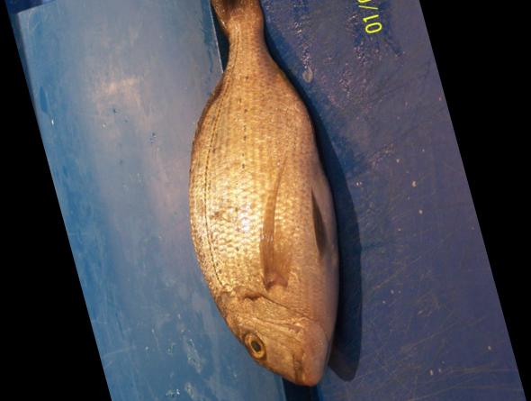

# Deep Learning: Recognising Fish Species using CNN 

In this deep learning project, we are using Convolutional Neural Networks(using MobileNet on Kera), to recognise the species of the given fish. Using REST API we can provide the required image to our python server, and it will return an array of probabilites for the 9 supported fish types.

## Fish Types

* Black Sea Sprat


* Gilt Head Bream


* Hourse Mackerel


* Red Mullet


* Red Sea Bream



* Sea Bass


* Shrimp


* Striped Red Mullet


* Trout


## Getting Started

* Run [server.py]() to start the REST API
* Use Postman/cURL on command-line to pass the image (localhost/predict)
* The REST API will return a JSON

Output format:

```
{
    "Predictions" : [
        {"label":fish_name,"probability":prob},
        {"label":fish_name,"probability":prob},
        ...],
    "success" : true
    }
```

## Built With

* [VSCode](https://code.visualstudio.com/) - IDE used
* [Kaggle](https://www.kaggle.com/fahadmehfoooz/fish-analysis) - Dataset used

## Authors

* **Tanush R** - [tanush-r](https://github.com/tanush-r)

